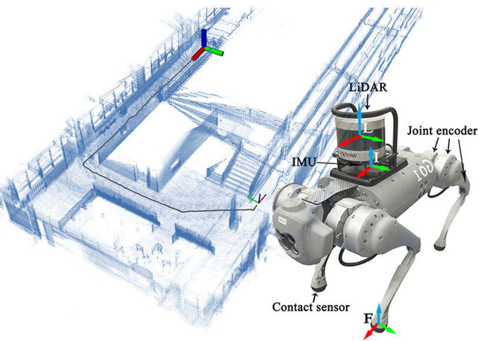
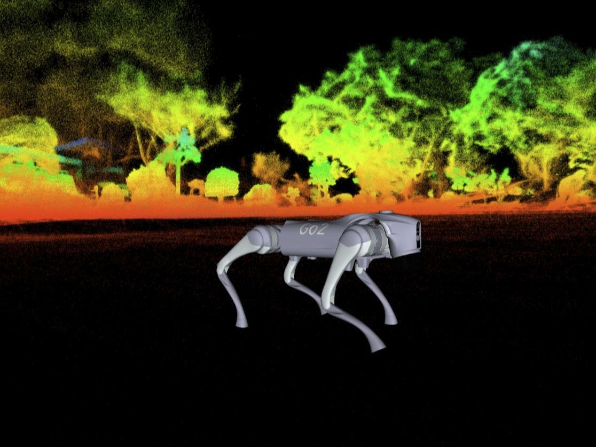

<h1 align="center">Leg-KILO 2.0</h1>
<h2 align="center">Robust Kinematic-IMU-Lidar Odometry</h2>

<p align="center">
  <!-- Bilibili 视频 -->
  <a href="https://space.bilibili.com/82127930/lists?sid=6240305&spm_id_from=333.788.0.0">
    
  </a>
  <!-- 论文 -->
  <a href="https://ieeexplore.ieee.org/document/10631676">
    
  </a>
</p>


Leg-KILO 2.0 is a kinematic–inertial–LiDAR tightly‑coupled error‑state Kalman filter odometry system. Both the methodology and implementation differ from the original paper. The new version of Leg‑KILO is more efficient and lightweight. Key features include:

- **Tight Sensor Fusion via ESKF**  
  All sensors (**LiDAR**, **IMU**, and **optional leg kinematics**) are fused in a single Error‑State Kalman Filter.

- **Per-Point LiDAR Observations & IMU as Model Observation**  
  Each LiDAR point is treated as an independent observation, and the IMU is used as a model observation—inspired by [Point‑LIO](https://github.com/hku-mars/Point-LIO). This makes the system more robust during high dynamic motion.

- **Voxel Map Management**  
  A voxel‑based map (based on [FAST‑LIVO2](https://github.com/hku-mars/FAST-LIVO2)) is used to organize and manage LiDAR map.

- **High Throughput**  
  Thanks to the ESKF and voxel map structure, single‑frame processing runs in **5–20 ms** .

- **Extensive Validation**  
  Tested on both self‑collected and public datasets, and validated on ***Unitree Go1*** and ***Go2*** robots(with more datasets under continuous testing). 

<p align="center">
  
  
</p>


# News
- **`2024.07.20`:** The paper is accepted by RA-L 2024!
- **`2024.07.31`:** The code is released.
- **`2025.07.20`:** Leg-KILO 2.0 is released.

# Prerequisites

Does not include any external optimization libraries; only requires common SLAM libraries such as Eigen and PCL.

Currently our code is tested on 

- Ubuntu 18.04
- ROS melodic
- pcl 1.8
- eigen 3
- [unitree_legged_msgs](https://github.com/unitreerobotics/unitree_ros_to_real) (has included in the project)
- glog
- yaml-cpp

```bash
sudo apt update && sudo apt install -y libpcl-dev libeigen3-dev libgoogle-glog-dev libyaml-cpp-dev
```

# Build

```bash
cd ~/legkilo_ws/src
git clone https://github.com/ouguangjun/Leg-KILO.git
cd ..
catkin build  # catkin_make
```

# Run

## Leg-KILO Dataset
Download our dataset from [link](https://github.com/ouguangjun/legkilo-dataset)

```bash
source devel/setup.bash
roslaunch legkilo leg_fusion.launch
rosbag play xxxx.bag
```

## Diter++ Dataset

Download [Diter++](https://www.google.com/url?q=https%3A%2F%2Fconstruction-robots.github.io%2Fpapers%2F66.pdf&sa=D&sntz=1&usg=AOvVaw2WSdHVs-7_zznSH2CZIeWH) dataset from [link](https://sites.google.com/view/diter-plusplus/home)

```bash
source devel/setup.bash
roslaunch legkilo diter.launch
rosbag play lawn_go2_lower_day.bag
```

# Acknowledgments

Thanks for their excellent open source work:

- [Point‑LIO](https://github.com/hku-mars/Point-LIO)
- [FAST‑LIVO2](https://github.com/hku-mars/FAST-LIVO2)
- [FASTER-LIO](https://github.com/gaoxiang12/faster-lio)
- [SAD](https://github.com/gaoxiang12/slam_in_autonomous_driving)
- [SVO](https://github.com/uzh-rpg/rpg_svo_pro_open)
- [A1-QP-MPC-Controller](https://github.com/ShuoYangRobotics/A1-QP-MPC-Controller).

# Citation
If you found this code/work to be useful in your own research, please considering citing the following information.

```
@ARTICLE{legkilo,
  author={Ou, Guangjun and Li, Dong and Li, Hanmin},
  journal={IEEE Robotics and Automation Letters}, 
  title={Leg-KILO: Robust Kinematic-Inertial-Lidar Odometry for Dynamic Legged Robots}, 
  year={2024},
  volume={9},
  number={10},
  pages={8194-8201},
  doi={10.1109/LRA.2024.3440730}}
```

# Contact
If you have questions, make an issue or contact me at [ouguangjun98@gmail.com](ouguangjun98@gmail.com) 

# Star History
<a href="https://www.star-history.com/#ouguangjun/Leg-KILO&Date">
  
</a>
