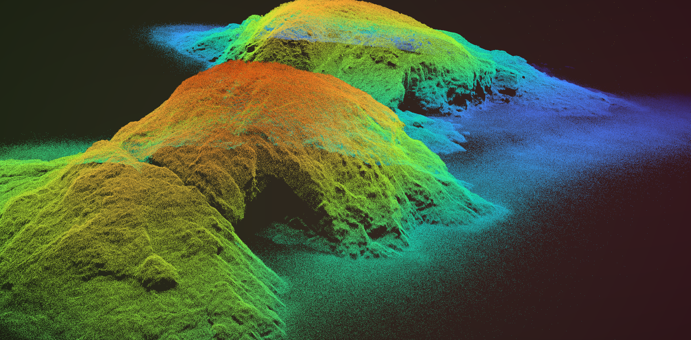
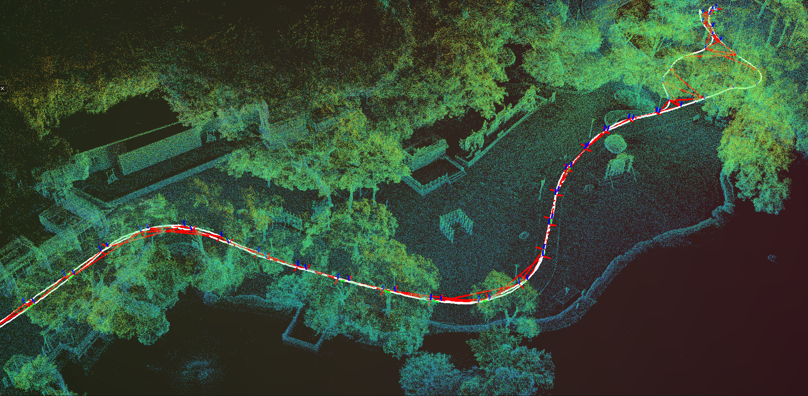
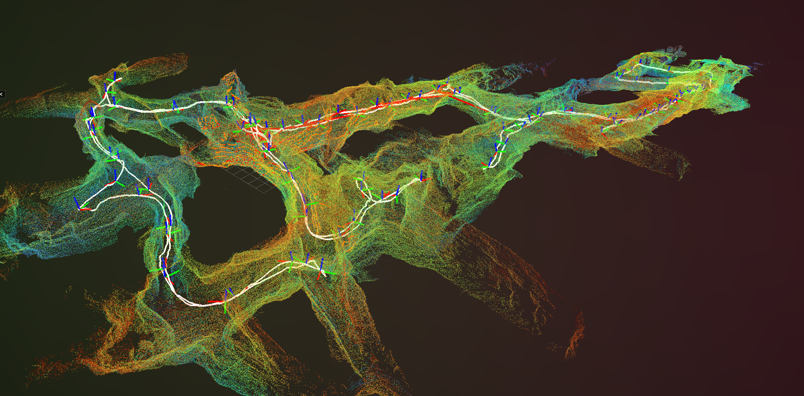
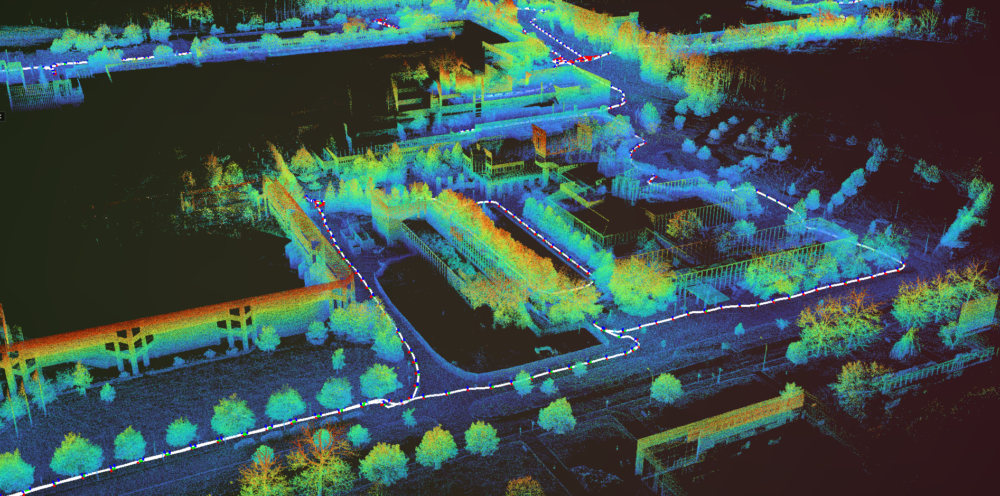
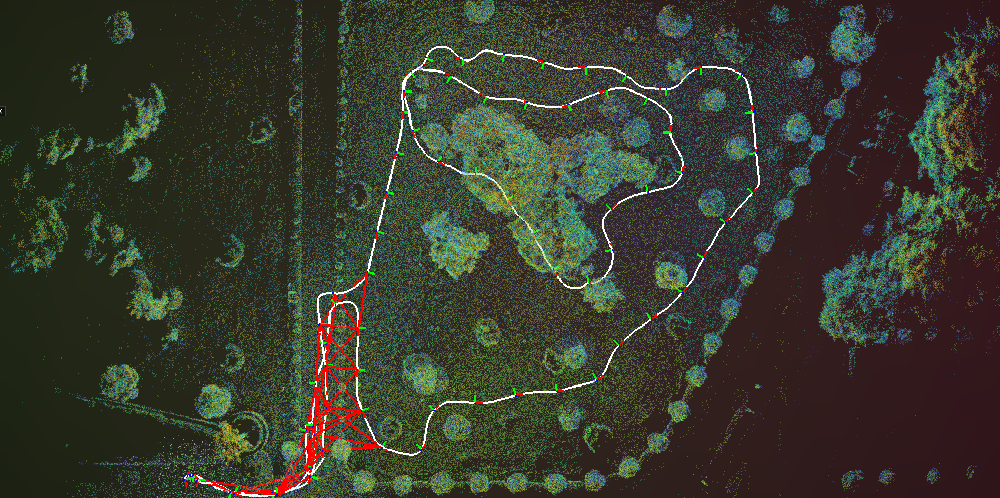
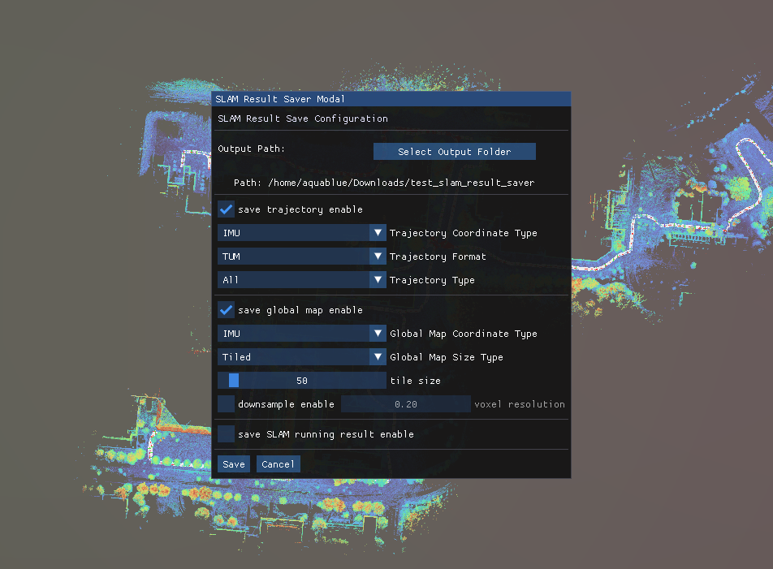
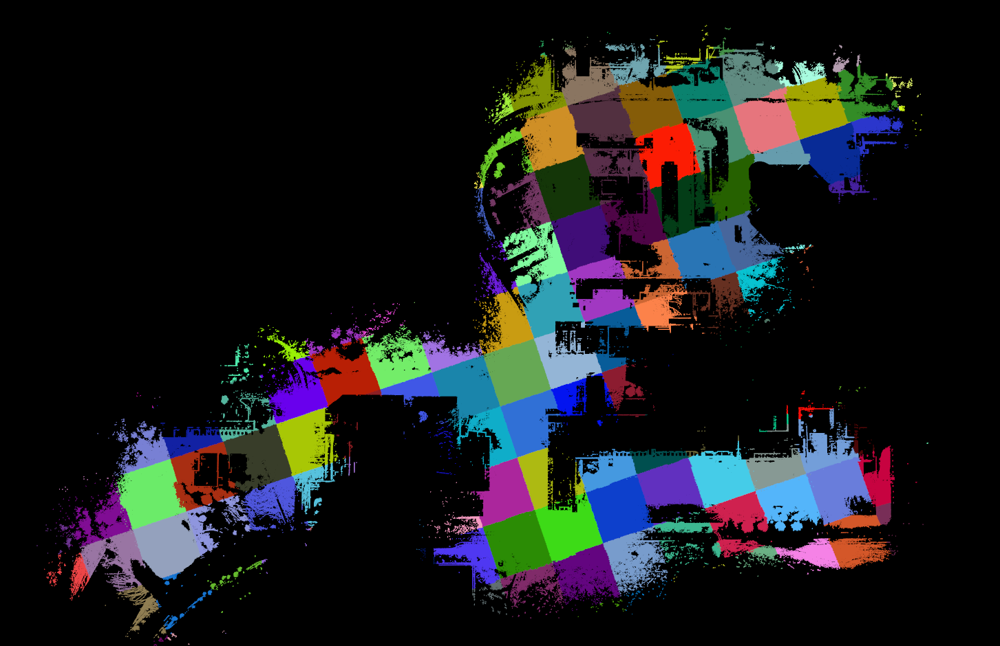

> ℹ️ **Project update:** [kilo-map](https://github.com/ouguangjun/kilo-map) has been manually merged into Leg-KILO. The two projects now provide essentially the same functionality.
>
> To view or use the previous **Leg-KILO 2.0** implementation, switch to the `legkilo-v2` branch:
>
> ```bash
> git checkout legkilo-v2
> ```

<h2 align="center">Robust Lidar-based Odometry and Mapping</h2>

<p align="center">
  <!-- Bilibili 视频 -->
  <a href="https://space.bilibili.com/82127930/lists?sid=6240305&spm_id_from=333.788.0.0">
    
  </a>
  <!-- ROS1 -->
  
  <!-- ROS2 -->
  
  <!-- License -->
  
  <a href="./README_CN.md">
    
  </a>
</p>

<p align="center">
  
</p>

kilo-map is a real-time LiDAR-based SLAM system with the following features:

- **Hybrid Feature Gaussian Voxel Map**: Incrementally maintains uncertain hybrid features (planar and NDT-variant), improving feature utilization across both structured and unstructured environments.

- **Two-Stage ESKF Frontend**: Fuses LiDAR and IMU in an Error-State Kalman Filter with a **two-stage lidar update** for high-dynamic motion: **Stage 1** performs incremental per-point ESKF updates along the scan timeline to compensate for motion distortion (analogous to Point-LIO); **Stage 2** backpropagates the distortion-corrected points to body frame and runs iterated ESKF (IESKF) over the full frame for global consistency refinement. This design makes the system robust against aggressive platform dynamics (e.g., legged robots) while preserving IESKF's fast convergence property.

- **Factor Graph Backend**: Uses Ceres-based factor graph optimization to tightly couple loop-closure constraints with odometry factors, reducing global drift. [small_gicp](https://github.com/koide3/small_gicp) and [KISS-Matcher](https://github.com/MIT-SPARK/KISS-Matcher) serve as verification modules for loop closure, improving matching accuracy.

- **Real-Time Visualization**: Built on [Iridescence](https://github.com/koide3/iridescence) for real-time 3D visualization and debugging. Outputs frontend and backend trajectories for algorithm evaluation, and supports saving global maps (as a single map or tiled blocks) for localization systems.

- **Cross-Platform Support**: Supports both ROS 1 and ROS 2, validated on multiple public datasets with different LiDAR sensors. Most configurations share the same YAML structure and require little to no parameter tuning across different platforms and sensor setups.

<p align="center">
  
  
  
  
</p>


# Prerequisites

This project supports both **ROS 1**  and **ROS 2**, and has been tested on these distributions(***melodic***, ***noetic***, ***foxy***). It should also work with ROS 2 distributions on Ubuntu 22.04 and 24.04 (e.g., ***Humble***, ***Jazzy***).

All third-party libraries and ROS message packages are bundled in this repository. You only need to install the following system dependencies via apt:

```bash
# required
sudo apt update && sudo apt install -y libeigen3-dev libpcl-dev libgoogle-glog-dev libgflags-dev libyaml-cpp-dev libboost-filesystem-dev libboost-system-dev libtbb-dev liblz4-dev libceres-dev libglm-dev libglfw3-dev

# optional
sudo apt install -y libpng-dev libjpeg-dev libassimp-dev
```


# Build

```bash
cd ~/kilo_map_ws/src
git clone https://github.com/ouguangjun/kilo-map.git
cd ..

# ros1
catkin_make # or catkin build

# ros2
colcon build
```

# Run

## Public dataset

The system has been validated on the following public datasets. Download a dataset and use its corresponding launch file (make sure the LiDAR type, topics, and extrinsic parameters in the YAML config match the data).

| Dataset | Dataset link | LiDAR | Config file | Notes |
| --- | --- | --- | --- | --- |
| Leg-KILO | [Download](https://github.com/ouguangjun/legkilo-dataset) | Velodyne VLP-16 | `legkilo_go1_velodyne.yaml` | — |
| NCLT | [Download](https://robots.engin.umich.edu/nclt/) | Velodyne HDL-32E | `nclt_velodyne.yaml` | — |
| SuperLoc | [Download](https://superodometry.com/superloc.html) | Velodyne VLP series | `superloc_velodyne.yaml` | — |
| M3DGR | [Download](https://github.com/sjtuyinjie/M3DGR) | Livox MID-360 | `m3dgr_mid360.yaml` | — |
| DiTer++ | [Download](https://github.com/sparolab/DiTer-plusplus) | Ouster OS1 | `diter_go2_ouster.yaml` | — |
| MARS-LVIG | [Download](https://mars.hku.hk/dataset.html) | Livox Avia | `mars_lvig_avia.yaml` | — |
| NeBula | [Download](https://github.com/NeBula-Autonomy/nebula-odometry-dataset) | Velodyne VLP-16 | `nebula_velodyne.yaml` | — |
| QuadSLAM | [Download](https://github.com/EN3D-Lab/Quadruped-SLAM-dataset) | Hesai XT16 (Velodyne format) | `quadruped_slam_velodyne.yaml` | — |
| Backpack2025 | [Download](https://github.com/CNITECH-CV-LAB/Backpack2025) | Hesai (dual LiDAR) | `backpack_hesai.yaml` | — |

Taking the legged robot [legkilo dataset](https://github.com/ouguangjun/legkilo-dataset) as an example:

```bash
# ROS 1
source devel/setup.bash
roslaunch legkilo legkilo_go1_velodyne.launch
rosbag play slope.bag

# ROS 2
source install/setup.bash
ros2 launch legkilo legkilo_go1_velodyne.py
# use rosbags-convert to convert ROS 1 bag to ROS 2 format
ros2 bag play ./slope_ros2
```

## Custom Dataset

To run with your own dataset, make sure the following YAML parameters are correctly configured:

1. **`lidar_topic`** / **`imu_topic`**: ROS topic names for the LiDAR and IMU data.
2. **`lidar_type`**: The LiDAR model. Currently supported: `velodyne`, `ouster`, `hesai`, `livox`. To add a new type, refer to `legkilo/src/preprocess/lidar_processing.h`.
3. **`time_scale`**: The scale factor to convert each LiDAR point's raw timestamp to seconds (e.g., `1e-9` for nanosecond timestamps, `1e-6` for microseconds). This varies across LiDAR models and even across different driver configurations for the same sensor.
4. **`sensor_type`**: The fusion mode. Use `LIO` for typical LiDAR-IMU setups.
5. **`extrinsic_T`** / **`extrinsic_R`**: The translation vector and rotation matrix of the IMU-to-LiDAR extrinsic transformation.
6. For best results, start mapping from a stationary state to allow the system to initialize IMU biases and the initial pose. Setting `init_type` to `2` enables gravity-aligned initialization.

# Save Map
<p align="center">
  
  
</p>

After the run completes, you can save the global map and trajectory via the **`Save Result`** button in the upper-left corner of the viewer.

# Related Publications

This project originated from the following paper, but has been substantially refactored and redesigned over time. It is no longer a direct implementation of the original work.

<details>
<summary>Leg-KILO (RA-L 2024)</summary>

```bibtex
@ARTICLE{legkilo,
  author={Ou, Guangjun and Li, Dong and Li, Hanmin},
  journal={IEEE Robotics and Automation Letters}, 
  title={Leg-KILO: Robust Kinematic-Inertial-Lidar Odometry for Dynamic Legged Robots}, 
  year={2024},
  volume={9},
  number={10},
  pages={8194-8201},
  doi={10.1109/LRA.2024.3440730}
}
```
</details>

# Contact

If you have questions, make an issue or contact me at [ouguangjun98@gmail.com](ouguangjun98@gmail.com) 

If you have ideas or suggestions for improvement, feel free to submit a PR or reach out!

# Maintainers

<a href="https://github.com/ouguangjun">
  
</a>

# License

This project is licensed under the MIT License - see the [LICENSE](LICENSE) file for details

# Acknowledgments

We gratefully acknowledge the following open-source projects:

- [Iridescence](https://github.com/koide3/iridescence) — real-time 3D visualization
- [small_gicp](https://github.com/koide3/small_gicp) — point cloud registration for loop-closure verification
- [KISS-Matcher](https://github.com/MIT-SPARK/KISS-Matcher) — point cloud registration for loop-closure verification
- [Sophus](https://github.com/strasdat/Sophus) — Lie group SO(3)/SE(3) math (exponential/log maps), MIT licensed

- [HKU-MaRS Lab](https://github.com/hku-mars) — for inspiration from their outstanding publications
- [Xiang Gao](https://github.com/gaoxiang12) — for his excellent open-source projects


# 免责声明

本项目为个人学习项目，出于兴趣分享，学术上不必过度细究😄
